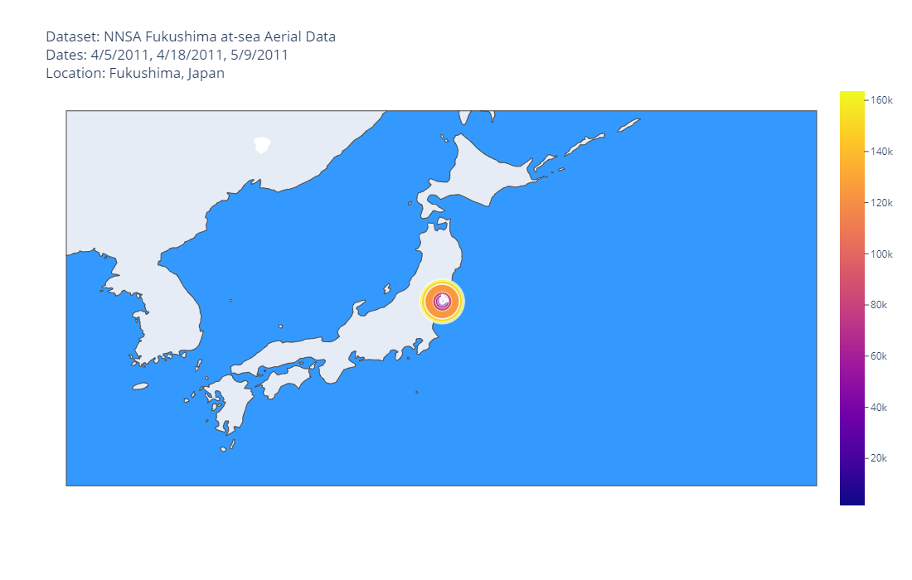
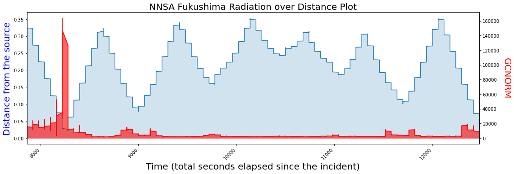

# NNSA-geospatial-analysis
 

# Overview
Geospatial visualization and analysis of Fukushima datasets created by NNSA.

# Introduction
National Nuclear Security Administration (NNSA) published 3 datasets that involves Fukushima nuclear disaster occurred in 2011 at Fukushima, Japan. These datasets measure aerial radioactive traces of different radio-isotopes (e.g., iodine-131) surveying the local area over time. The first dataset measures thallium activated sodium iodine (NAI(T)) crytals off the east coast of Japan on three separate flights dated 4/5, 4/18, 5/9 of 2011. The second dataset represents the ground deposition of Iodine-131 indicating surface contamination measured from 2-3 April 2011. The last dataset is the radiation data in DOE/NNSA response to the Fukushima incident measuring NaI(T) crystals emitting radiation between 17-19 March 2011.

# Main Notebooks
Some sections of the notebooks use plotly for interactive visualization which renders properly in nbviewer.

- NNSA Geospatial Visual Analysis ([nbviewer](https://nbviewer.org/github/jshinm/NNSA-geospatial-analysis/blob/main/NNSA-geospatial-visual-analysis.ipynb))
    
    
- NNSA Geospatial Predictive Analytic + EDA ([notebook](https://github.com/jshinm/NNSA-geospatial-analysis/blob/main/NNSA-geospatial-predictive-analytic.ipynb))
    
    

# Data Catalogs
- https://catalog.data.gov/dataset/us-doe-nnsa-response-to-2011-fukushima-incident-at-sea-aerial-data
- https://catalog.data.gov/dataset/us-doe-nnsa-response-to-2011-fukushima-incident-iodine-131-aerial-data-analysis
- https://catalog.data.gov/dataset/us-doe-nnsa-response-to-2011-fukushima-incident-march-2011-aerial-data

# Documentations
- https://www.energy.gov/sites/prod/files/2013/10/f3/AMS%20C12%20Sea%20Data%20Dictionary.pdf
- https://www.energy.gov/sites/prod/files/2014/05/f16/Iodine%20Deposition%20from%20Early%20Aerial%20Surveys.pdf
- https://www.energy.gov/sites/prod/files/NNSADataRepositoryGuide_0.pdf

# Future Updates
- analysis notebook (unsupervised methods)
- aws integration
- build and delpoy with docker